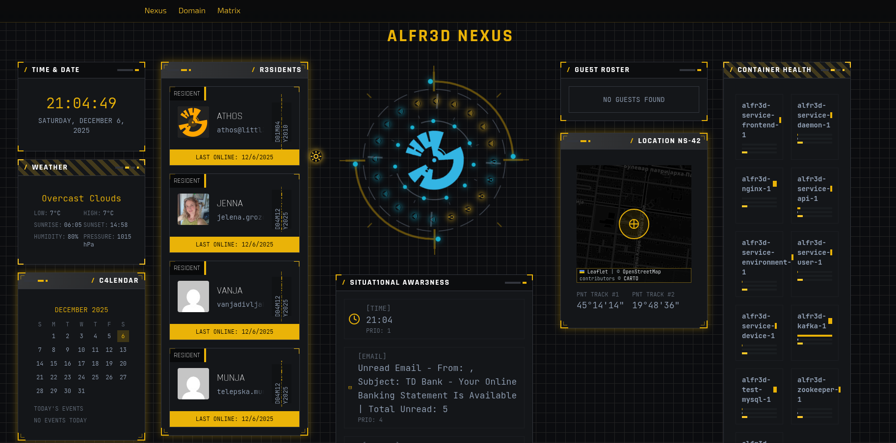
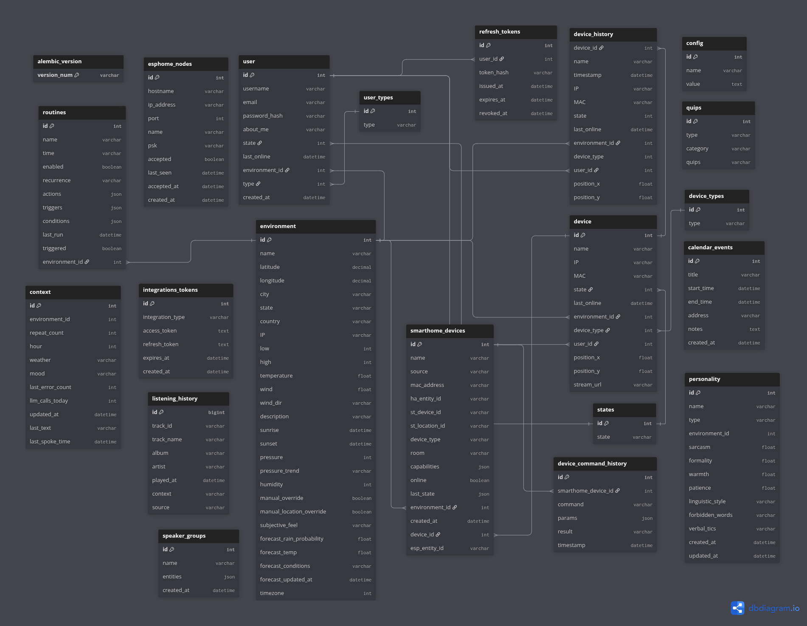
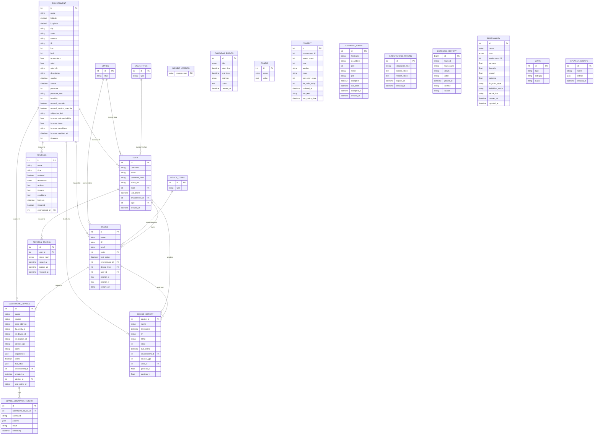

# ALFR3D

A containerized microservices project for home automation, featuring Kafka messaging, MySQL database, Redis caching, and Python services. Includes a modern React web frontend with real-time dashboard monitoring, comprehensive user/device management, Spotify music integration with context-aware recommendations and whole-home speaker casting, RTSP camera streaming, and a WHEN/IF/THEN routine automation engine.

[](https://github.com/Littl3-1-Engineering/alfr3d/actions/workflows/ci.yml)
[](LICENSE)
[](https://deepwiki.com/Littl3-1-Engineering/alfr3d)

## Stack

- **Backend**: Python 3.14, FastAPI/Flask microservices (see [Services](#services))
- **Frontend**: React 18 + Vite, Tailwind CSS, React Query, Recharts, D3.js, Leaflet, hls.js, Framer Motion/Lottie
- **Messaging**: Kafka
- **Database**: MySQL 8, Alembic migrations
- **Cache**: Redis
- **Containerization**: Docker Compose (local dev), Kubernetes (production)

## Features

- **Microservices Architecture**: Modular services for users, devices, environment, daemon, music, and frontend.
- **Music & Spotify**: Full Spotify OAuth integration with playback control (play/pause/next/previous/seek/volume/queue), playlist browsing, device transfer, a context-aware recommendation engine, and whole-home speaker casting to Home Assistant media players.
- **Context-Aware Music Recommendations**: Collaborative-filtering recommender plus an explainable mood/genre/energy engine (occupancy, guests, time of day, weather) that resolves into specific real Spotify playlists — exposed both on-demand (`/api/music/recommend/playlist`) and as situational-awareness music cards during detected gatherings.
- **Situational Awareness Registry**: Rule-driven engine (`DISPLAY_RULES` in `alfr3ddaemon.py`) — new card types register as `(rule_id, priority, check_method)` triples without hardcoding a display slot; cards cover time, upcoming events, leave-by travel guidance, gathering music, call focus alerts, unread email, rain advisories, current weather, and ambient day mood.
- **Weather Forecast**: OpenWeatherMap 5-day/3-hour forecast snapshot (rain probability, forecast temp/conditions) persisted to the `environment` table hourly (`forecast_*` columns, migration 019) and consumed by the situational-awareness rain advisory ("Rain likely in the next 6 hours — bring an umbrella").
- **Camera Streaming**: RTSP cameras streamed to the browser via an ffmpeg proxy (MJPEG) or persistent RTSP→HLS pipelines with hls.js playback and snapshot capture.
- **Routine Automation (WHEN/IF/THEN)**: Time-, sunrise/sunset-, and event-triggered routines with conditions (occupancy, device state, temperature, mode) and actions (speak, device, email, thermostat, lock, cover, music, cast).
- **Personality & Quips**: Configurable personality matrix with semantic quip categories, one-click presets, context inputs, and optional LLM configuration for generated responses.
- **Theme System**: Centralized theme tokens (single source of truth) with three built-in themes (Cyan/Navy, Amber/Charcoal, Light/Teal) and a live theme picker that persists across sessions.
- **Real-Time Dashboard**: Live monitoring with CPU/memory, user, device, and IoT device metrics via WebSocket (no HTTP polling). Event types broadcast: events, situational awareness, containers, users, devices, IoT devices, weather, environment, calendar events, personality state, project tree.
- **Project Tree Visualization**: Interactive D3.js force-directed tree (1000x400px) showing the full project structure in the Nexus dashboard. Features animated swaying nodes, click-to-expand/collapse, auto-fit zoom, dark background matching tactical panel styling, and real-time updates when files change.
- **Messaging**: Kafka-based communication between services with topics: `speak`, `user`, `device`, `environment`, `event-stream`, `google`, `situational-awareness`, `integrations`, `personality`. Includes text-to-speech audio generation.
- **IoT Integration**: Home Assistant, SmartThings, and ESPHome device integration with unified API endpoints, periodic sync, blueprint display with MAC-based device linking, and real-time device state updates via WebSocket. ESPHome is local-only (mDNS discovery + Noise-encrypted native API, no cloud account) and runs always-on in parallel with whichever of HA/SmartThings is set as the default provider.
- **System Management**: In-browser system panel with network info, database table counts/backup, environment config editor, and service health/restart.
- **Optimized Performance**:
  - Python 3.14 + Node 24 LTS base images across all services
  - Redis caching layer (TTLCache with in-memory fallback) for users/devices/weather/environment/personality/quips/routines
  - DBUtils connection pooling across all services
  - Vite with gzip/brotli compression for ~70% smaller bundles
  - Manual chunk splitting for parallel loading and better caching
  - React Query for client-side API caching (5-min stale time)
  - orjson for 3-10x faster JSON serialization
  - Alembic migration chain (versions 0001-0020) wrapping all raw SQL migrations
  - Slow-query MySQL config with targeted indexes
  - Multi-stage frontend build and BuildKit pip cache
- **Authentication & RBAC**: JWT access + revocable refresh tokens, a role-based permission matrix (`technoking`/`resident`/`guest`) enforced on all write routes, login/claim rate limiting, no username-enumeration, and self-service/admin-assisted password change and reset. Both the React webapp and the Nexus Launcher (Keystore-backed on Android) have full sign-in UI. See [Authentication & RBAC](#authentication--rbac) below.
- **Database**: MySQL with optimized, secure queries and comprehensive schema.
- **Security**: Parameterized SQL queries to prevent injection; password hashing (pbkdf2:sha256); secrets-at-rest encryption for integration credentials; secure API endpoints.
- **Modern UI**: Dark tactical theme with professional styling, responsive design, and intuitive navigation.
- **Testing**: Comprehensive unit tests, integration tests, API endpoint testing, and frontend tests (Vitest + React Testing Library).
- **Containerization**: Docker Compose for local development; Kubernetes manifests for production deployment.
- **Deployment**: Full Minikube support with ingress configuration and persistent storage.

### Screenshot



### Music & Spotify

ALFR3D integrates Spotify for full music control and context-aware recommendations:

#### Features
- **Spotify OAuth**: Credential setup and OAuth callback flow via the Music tab (`/api/music/spotify/auth`, `/api/music/spotify/callback`), with tokens stored in the database.
- **Playback Control**: Play, pause, next, previous, seek, volume, queue browsing, and queue additions (`/api/music/spotify/*`).
- **Device Management**: List available Spotify Connect devices and transfer playback (`/api/music/spotify/devices`, `/api/music/spotify/device`).
- **Search & Playlists**: Search tracks and browse the household's saved playlists (`/api/music/spotify/search`, `/api/music/spotify/playlists`).
- **Recommender Engine**: Collaborative-filtering recommendations via `/api/music/recommend` using the `listening_history` table (migration 013), with context (time-of-day/weekday), rediscovery, and explainable reasons. The daemon rebuilds the recommendation pool in the background (`rebuild_music_recommendations()`).
- **Playlist Recommendation**: `/api/music/recommend/playlist` resolves current mood/genre/energy into one specific real Spotify playlist — the household's saved playlists are matched first by keyword, falling back to a global Spotify playlist search. Gathering-triggered situational-awareness cards (mode `music`) embed the resolved playlist name, URI, URL, and cover art.
- **Speaker Casting**: Cast playback to Home Assistant media players or speaker groups with volume control (`/api/music/cast`, `/api/music/cast/stop`, `/api/music/cast/volume`, `/api/music/speakers`, `/api/music/speakers/groups`). Speaker groups are stored in the `speaker_groups` table (migration 014).
- **Audio Visualizer**: Spotify doesn't stream audio to the browser (playback runs on a Connect device), so the now-playing visualizer is driven by `/audio-analysis` segment loudness (`/api/music/spotify/audio-analysis/{track_id}`), rendering 56 bars synced to playback position.
- **Voice & Routine Actions**: Music actions (play, pause, next, previous, volume) and cast/stop-cast actions are available in routine automation and voice command routing.
- **Music Tab**: The Matrix page's Music tab provides the player with now-playing display, visualizer, playlist browser, device selector, speaker casting UI, and credential/OAuth setup.
- **Scheduled Playback**: The daemon plays context-aware tunes (people/time/weather) on schedule (e.g. mornings) via `play_tune()`.

#### Database Schema
- **`listening_history`**: Logs played tracks (track, album, artist, played_at, context, source) to feed the recommender
- **`speaker_groups`**: Named groups of HA media_player entity IDs for whole-home casting

#### API Endpoints
- `GET /api/music/spotify/status`: Spotify connection status
- `POST /api/music/spotify/auth`: Save Spotify credentials
- `GET /api/music/spotify/auth`: OAuth authorization URL
- `GET /api/music/spotify/callback`: OAuth callback handler
- `POST /api/music/spotify/play|pause|next|previous|seek|volume`
- `GET /api/music/spotify/queue`, `POST /api/music/spotify/queue/add`
- `GET /api/music/spotify/devices`, `POST /api/music/spotify/device`: Device listing/transfer
- `GET /api/music/spotify/search`: Track search
- `GET /api/music/spotify/playlists`: Saved playlists
- `GET /api/music/spotify/audio-analysis/{track_id}`: Segment loudness for the visualizer
- `GET /api/music/recommend`: Recommender-engine suggestions
- `GET /api/music/recommend/playlist`: Contextual playlist recommendation (library-first)
- `GET /api/music/recommend/refresh`: Trigger recommendation pool rebuild
- `POST /api/music/history`: Record listening history
- `GET /api/music/speakers`: Available speakers
- `POST /api/music/cast`, `/api/music/cast/stop`, `/api/music/cast/volume`: Speaker casting
- `POST /api/music/speakers/groups`: Manage speaker groups

### Camera Streaming

RTSP security cameras can be viewed directly in the browser:

#### Features
- **MJPEG Proxy**: `/api/camera` streams an RTSP source through an ffmpeg proxy as MJPEG frames.
- **HLS Streaming**: `/api/hls/start`, `/api/hls/stop`, `/api/hls/status` manage a persistent ffmpeg RTSP→HLS remux pipeline; playlists and segments served from `/api/hls/`. Includes PCM/ALAW audio transcoding for HLS playback compatibility.
- **hls.js Playback**: CameraStream panel uses hls.js with Safari native-HLS fallback, automatic reconnect, and snapshot capture.
- **Configuration & Snapshot**: `/api/camera/config` returns the configured source; `/api/camera/snapshot` grabs a single frame.

#### API Endpoints
- `GET /api/camera`: MJPEG stream proxy
- `GET /api/camera/config`: Camera source configuration
- `GET /api/camera/snapshot`: Single-frame snapshot
- `POST /api/hls/start`, `POST /api/hls/stop`, `GET /api/hls/status`: HLS pipeline control
- `GET /api/hls/index.m3u8`, `GET /api/hls/{filename}`: Playlist and segment serving

### Routine Automation

ALFR3D supports a full WHEN / IF / THEN recipe model:

#### Triggers (WHEN)
- **Time**: Scheduled times with recurrence (once, daily, weekdays, weekly)
- **Sunrise / Sunset**: Fires at local solar sunrise/sunset (environment timezone)
- **Person arrives / leaves**: Occupancy events per user
- **Device turns on / off**: Device state-change events
Multiple triggers are OR-combined; a routine fires when any match.

#### Conditions (IF)
All configured conditions must evaluate true:
- **Person is home / away**
- **Anyone home / Nobody home**
- **Device is on / off**
- **Temperature above / below**
- **Mode is** (day/night/home/away)

#### Actions (THEN)
- **Speak**: Text-to-speech messages via the speak service
- **Device**: Control LAN/IoT devices
- **Email**: Send email notifications
- **Set thermostat**: Target temperature
- **Lock / Unlock**: Door lock control
- **Open / Close cover**: Blinds/cover control
- **Music (Spotify)**: Play, pause, next, previous, set volume, cast to speaker, stop casting

#### Configuration
1. Navigate to Matrix page → Routines tab
2. Click "New Routine" to create a routine
3. Add triggers, conditions, and actions
4. Save and enable the routine
5. Run routines on-demand with the play button

#### Database Schema
- **`routines`**: Stores routine definitions with name, time, recurrence (once/daily/weekdays/weekly), triggers (JSON), conditions (JSON), actions (JSON), and last_run timestamp (migration 009)

### Personality & Quips

- **Personality Matrix**: Configure the daemon's persona (name, tone, energy) via `/api/personality`
- **Presets**: Save/apply named personality presets (`/api/personality/presets`, `/api/personality/apply-preset`)
- **Context**: Manage personality context inputs (`/api/personality/context`)
- **LLM Config**: Optionally configure an LLM for generated responses in the speak service (`/api/personality/llm-config`)
- **Quip Categories**: Quips are grouped into semantic categories — greeting, weather_joke, sarcasm, wisdom, goodbye, custom — filterable via `GET /api/quips?category=...` (migration 011)

### Theme Customization

- **Single Source of Truth**: `src/utils/themes.js` holds all color tokens; `themes.css` is auto-generated from it via `npm run generate:theme` (wired into predev/prebuild) so they can never drift apart
- **Semantic Tailwind Classes**: `fui-*` utilities (fui-accent, fui-magenta, fui-env, fui-panel, etc.) derive from the active theme
- **Built-in Themes**:
  - Cyan / Navy (default) — deep navy substrate with glowing cyan accents
  - Amber / Charcoal — ultra-deep charcoal with electric amber highlights
  - Light / Teal — whites and grays with teal primary
- **Live Picker**: Matrix → Customizations lets you switch themes instantly; changes persist across sessions
- Components use only theme tokens — no hardcoded colors

### System Management

- **Health**: `GET /api/health` returns service uptime, container status, and the version from `services/service_api/VERSION`
- **Network**: `GET /api/system/network` shows host/IP/interface info
- **Database**: `GET /api/system/database` reports per-table row counts; `POST /api/system/database/backup` dumps the database
- **Config**: `GET/PUT /api/system/config` reads/edits the environment configuration file
- **Services**: `GET /api/system/services` lists running services; `POST /api/system/services/{name}/restart` restarts a service

### IoT Integration

ALFR3D supports integration with Home Assistant, SmartThings, and ESPHome for unified smart home control. HA and SmartThings share a single "default provider" selector; ESPHome is local-only (mDNS discovery + Noise-encrypted native API, no cloud account or URL/token) and runs always-on in parallel regardless of that selection.

#### Features
- **Unified Device Management**: View and control HA, ST, and ESPHome devices from a single interface
- **Automatic Sync**: HA/ST/ESPHome devices sync automatically every 15 minutes via the daemon service; ESPHome nodes are additionally rediscovered over mDNS every hour
- **Real-Time States**: IoT device states stream over WebSocket (30s refresh) — no HTTP polling
- **Blueprint Visualization**: Linked IoT devices appear on the floorplan with proper device type icons
- **Manual Device Linking**: Link IoT devices to alfr3d devices via Domain → Devices → SMARTHOME DEVICES section
- **Linked-Only Filtering**: `GET /api/iot/devices?linked=true` shows only linked devices; sync no longer auto-creates device rows for unmatched devices
- **Device Type Controls**: ControlBlade provides type-specific controls (lights, thermostats, locks, fans, covers, media players)
- **Sensor Display**: View sensor readings (temperature, humidity, battery) in ControlBlade
- **Linked Status**: Linked devices show "LINKED" in blue, unlinked show warning icon
- **FK Relationship**: smarthome_devices.device_id links to device table for type and position
- **ESPHome Manual Accept**: Discovered ESPHome nodes require an explicit accept step (with an optional PSK) before ALFR3D connects — mDNS discovery isn't account-scoped like HA/ST, so nodes never auto-link
- **Centralized Control**: Every IoT device — including HA-backed speakers, previously only reachable from the Music tab's cast controls — is controllable from the Blueprint via ControlBlade, routed through the single provider-agnostic `POST /api/iot/devices/{device_id}/control` endpoint rather than feature-specific tabs

#### Configuration
1. Configure Home Assistant via the Integrations page:
   - HA URL (e.g., `http://192.168.1.x:8123`)
   - Long-Lived Access Token

2. Configure SmartThings via the Integrations page:
   - Personal Access Token (PAT)

3. Set default provider in IoT settings

4. Configure ESPHome via the Integrations page:
   - Click "Scan for ESPHome devices" to run an mDNS discovery pass (~8s)
   - Accept each discovered node individually, with an optional PSK if the node has Noise-protocol encryption enabled
   - No default-provider selection needed — accepted nodes sync alongside HA/ST automatically

#### Linking Devices
1. Go to Domain → Devices tab
2. Scroll to "SMARTHOME DEVICES" section
3. Click the Link button (chain icon) on an unlinked device
4. Select an ALFR3D device to link to
5. The device will now appear on the Blueprint with proper icon and controls

#### Available Device Controls
- **Lights**: Power toggle, brightness slider
- **Switches**: Power toggle
- **Climate**: Temperature up/down, current/target display
- **Locks**: Lock/unlock toggle
- **Fans**: Power toggle, speed selector
- **Cover**: Position slider, open/close buttons
- **Media Players**: Play/pause, volume slider
- **Sensors**: Display readings (temperature, humidity, battery, etc.)

#### Database Schema
- **`smarthome_devices`**: Stores synced IoT devices with source (homeassistant/smartthings), entity IDs, MAC addresses, and device_id FK to device table. Migration 017 deduplicates stale rows and restores the unique key so syncs upsert in place.
- **`device`**: Local device table stores linked devices with type from device_types
- **`device_types`**: Expanded to include fan, climate, cover, lock, media_player, sensor, binary_sensor, camera
- **`device_command_history`**: Tracks device control commands for audit logs

#### API Endpoints (Additional)
- `PUT /api/iot/devices/{id}/link`: Link/unlink IoT device to local device
- `GET /api/iot/devices?linked=true`: Filter to linked devices

#### Sync Mechanism
- Daemon sends Kafka messages (`iot_ha_sync`, `iot_st_sync`) every 15 minutes
- Device service fetches devices from HA/ST APIs and updates the database
- MAC addresses extracted from HA entity connections for device auto-linking
- On sync: looks up MAC in device table, sets device_id FK (no auto-creation for unmatched devices)
- Frontend uses FK join for position data

### Authentication & RBAC

Every write action (POST/PUT/DELETE) on the API requires a bearer token and a role with the
right grant; `GET` routes stay open/read-only for anonymous callers by design — this is what
lets the API be safely exposed on hardware (Alfr3d Kit) or through a relay (Butler) without
handing out full control to anyone who can reach it.

- **Claim your account**: existing household member rows don't have a password until you set
  one — `POST /api/auth/claim` with `{"username", "password"}` (only works once per account; a
  password already set means it's already claimed).
- **Login**: `POST /api/auth/login` with `{"username", "password"}` returns a short-lived JWT
  access token (~15 min) and a longer-lived, revocable refresh token. `POST /api/auth/refresh`
  trades a valid refresh token for a new pair (rotated on every use); `POST /api/auth/logout`
  revokes it.
- **Roles**: `technoking` (an Athos-only backdoor, never assignable via any UI), `owner` (the
  real assignable admin role — full CRUD on other users, integrations, system config), `resident`
  (everyday household actions — devices, routines, music playback, quips, IoT device control),
  `guest` (read-only, identical to an unauthenticated caller). `owner` is aliased to `technoking`
  in the permission matrix, so it gets identical admin grants without being the backdoor role. The
  full matrix is in `services/service_api/auth/permissions.py`.
- **Shipped**: both clients have full login UI — the React webapp (Sign In/Sign Out in the nav
  bar, route-level view-only gating for unauthenticated visitors) and the Nexus Launcher (a
  Keystore-backed sign-in inside Settings, gating device control/resident CRUD/manual routine
  run-or-edit while leaving every read surface usable signed out). Also shipped: login/claim rate
  limiting, no username-enumeration on failed login or claim, self-service + admin-assisted
  password change/reset (`POST /api/auth/change-password`, `POST /api/auth/admin-reset-password`),
  first-run onboarding (claim a seeded resident or generate a new `owner` account, in the webapp
  and the launcher), self-service profile editing ("My Profile", never able to change your own
  role), and full owner/technoking administration of other users through the web UI — add/edit/
  delete, plus a generate-and-display password reset — with every mutating control hidden from
  non-admins (the roster itself stays visible read-only). See `todo/todo_auth_rbac.md`,
  `todo/todo_onboarding_first_user.md`, `todo/todo_user_management.md`, and
  `todo/todo_household_admin_ui.md` for full history.
- **Decided against**: an emailed onboarding-OTP step — `claim`/`bootstrap` already require
  physical-device or local-network access, so an emailed code would add no real security there
  (see `todo/todo_email_service.md`'s Decision section). Household units don't send email at all.
- **Not yet shipped**: an owner-administers-household surface on the Nexus Launcher (a v2
  decision, not yet scoped).
- **Solo-owner lockout recovery**: `setup/reset_owner_password.py` resets any user's password
  directly against the DB, bypassing the API entirely — for the one gap admin-assisted reset
  doesn't cover (a solo-owner household with nobody else to run it). Gated on already having
  shell/`docker compose exec` access to the Kit's own host, not on email.

### Secrets at Rest

Integration credentials (Home Assistant long-lived token, SmartThings PAT, Spotify client
secret, ESPHome node PSKs) are encrypted at rest using Fernet symmetric encryption
(`services/common/secrets_utils.py`), so a database dump or backup leak doesn't hand out live
credentials directly.

- **Zero-config key provisioning**: the encryption key (`ALFR3D_SECRETS_KEY`) is auto-generated
  on first boot and persisted to the `secrets_data` Docker volume — no setup step required.
- **⚠️ Back up the `secrets_data` volume.** If it's lost, every stored integration credential
  becomes permanently unrecoverable and must be re-entered from the Integrations page. There is
  no key-rotation or recovery mechanism in v1.
- Existing plaintext values (from before this feature shipped) keep working — the read path
  tries to decrypt and falls back to the raw value on failure, so the database self-heals to
  fully-encrypted as each credential gets naturally rewritten (e.g. the next OAuth refresh).
- To manage the key yourself instead (e.g. Kubernetes secret injection), set `ALFR3D_SECRETS_KEY`
  directly in the environment — it takes precedence over the generated file.

### Dashboard Features

The ALFR3D dashboard provides real-time monitoring and control across three pages:

#### Nexus (Dashboard)
- **Boot Sequence**: Animated Lottie logo with boot-log and glitch effects
- **Core Clock**: 24h clock ring with solar/lunar ephemeris satellites; uptime/version tooltip
- **Real-Time Metrics**: Live CPU/memory, service health bars, user/device/IoT metrics via WebSocket
- **WeatherPanel**: Animated weather icon, large current temp, wind + pressure trend
- **ResidentsSummary**: Residents vs. guests online
- **Situational Awareness**: Live, priority-ordered cards from a registry-based engine (`DISPLAY_RULES`) — time, upcoming events, leave-by travel guidance (drive time and fuel cost, when a destination and Google Maps are configured), gathering-triggered music, "call starting soon" focus alerts, unread email, forward-looking rain advisories (from the persisted `forecast_rain_probability` snapshot), current weather, and ambient day-mood; music cards link to the resolved Spotify playlist
- **Calendar & Event Stream**: Upcoming events and event feed
- **Camera Stream**: Live RTSP camera panel
- **Project Tree**: Interactive force-directed visualization of the project structure
- **Health Indicators**: Visual status (🟢 Healthy, 🟡 Warning, 🔴 Unhealthy)
- **Connection Lines**: Animated Kafka topic flows between services

#### Domain (Device Management)
- **User Management**: Registration, editing, deletion with role-based access
- **Device Control**: Network scanning, device state monitoring, device history
- **IoT Devices**: Home Assistant / SmartThings device registry, linking, and ControlBlade
- **Blueprint**: Floorplan visualization with linked IoT devices

#### Matrix (Automation & Control Hub)
- **Routines**: WHEN/IF/THEN recipe builder with triggers, conditions, and actions
- **Personality**: Persona configuration, presets, context, and LLM settings
- **Integrations**: Home Assistant, SmartThings, Gmail, Calendar, OpenWeather, and Google setup
- **Customizations**: Live theme picker (Cyan/Navy, Amber/Charcoal, Light/Teal)
- **Music**: Spotify player with now-playing, visualizer, playlists, devices, and speaker casting
- **System**: Network, database, config editor, and service management

#### Visual Design
- **Tactical FUI Theme**: Dark theme with consistent theme tokens and glowing accents
- **Responsive Layout**: Works on desktop and mobile devices
- **Interactive Elements**: Hover effects and smooth animations
- **Navigation**: Unified nav bar across all pages

## Build & Run

### Local Development with Docker Compose

1. **Prerequisites**: Ensure Docker and Docker Compose are installed. For faster builds, enable BuildKit:
   ```bash
   export DOCKER_BUILDKIT=1
   ```

2. **Environment Setup**: Copy `.env.example` to `.env` and update environment variables (DB credentials, Kafka URLs).
3. **Start All Services**:
   ```bash
   ./setup/build_images.sh
   docker-compose up -d mysql
   docker-compose exec mysql mysql -u root -p${MYSQL_ROOT_PASSWORD} < setup/createTables.sql
   docker-compose up -d
   ```
   To run database migrations separately: `docker compose --profile test up migrate`
4. **Access the Application**:
   - Dashboard: `http://localhost` (via nginx on port 80)

Note: Service Device runs as a standalone container for network scanning and should be deployed separately on the host machine.

The `setup/` directory contains scripts for database initialization, maintenance, and integration setup:

### Database Setup
- **`createTables.sql`**: Initial database schema creation with all tables, indexes, and triggers
- **Migrations** (`setup/migration_*.sql`): Incremental schema changes, wrapped in the Alembic chain (`setup/migrations/versions/0001-0020`):
  - `001_calendar_cleanup.sql` / `002_iot.sql` / `003_routines.sql`
  - `004_personality.sql` / `005_indexes.sql` / `006_personality_context.sql`
  - `007_device_types_expansion.sql` / `008_iot_device_link.sql`
  - `009_routines_v2.sql` (triggers + conditions)
  - `010_slow_query_indexes.sql` / `011_quip_categories.sql` / `012_weather_expansion.sql`
  - `013_listening_history.sql` / `014_speaker_groups.sql`
  - `015_environment_timezone.sql` / `016_iot_device_cleanup.sql` / `017_iot_dedupe.sql`
  - `018_weather_forecast.sql` (forecast rain probability / temp / conditions snapshot)
  - `019_esphome.sql` (ESPHome per-entity ID column + `esphome_nodes` table)
- **`drop_cleanup_trigger.sql`**: Script to remove old cleanup triggers

## Development

### Architecture Overview
- **Backend**: FastAPI-based microservices with Kafka messaging and REST API gateway
- **Frontend**: React application with real-time WebSocket updates and React Query caching
- **Database**: MySQL with comprehensive schema and Alembic migrations
- **Cache**: Redis with TTL and in-memory fallback
- **Deployment**: Docker Compose (dev) and Kubernetes (prod)

### Services

- **Zookeeper**: Required for Kafka coordination and cluster management.
- **Kafka**: Message broker with auto-created topics (`speak`, `user`, `device`, `environment`, `event-stream`, `google`, `situational-awareness`, `integrations`, `personality`) for inter-service communication.
- **MySQL**: Database with comprehensive schema including users, devices, environments, routines, states, listening history, and speaker groups.
- **Redis**: Cache layer for frequently-accessed data with TTL and in-memory fallback (users, devices, weather, environment, personality, quips, routines).
- **Migrate**: Alembic migration runner — applies `setup/migrations/versions/0001-0020` against MySQL on startup.
- **Test MySQL**: Separate MySQL instance (port 3307, `test_alfr3d_db`) for pytest fixtures to avoid interfering with production data.
- **Service Daemon**: Core orchestration service handling voice commands, Google integrations, a registry-based situational-awareness engine (time/events/travel/gathering-music/focus/email/rain-advisory/weather/mood cards), event-based travel planning with fuel-cost estimation, weather + forecast scheduling, gathering detection and music cards, context-aware scheduled tune playback, music recommendation rebuilds, and message routing.
- **Service User**: Manages user accounts, authentication, and online/offline status tracking.
- **Service Device**: Manages IoT devices, performs network scanning with arp-scan, and device state monitoring. Runs as a standalone container on the host machine for direct network access.
- **Service Environment**: Handles geolocation, weather updates, environmental data collection, and timezone-aware time-of-day logic.
- **Service API**: FastAPI REST API gateway with native WebSocket support, providing endpoints for users, devices, containers, routines, personality, IoT metrics, music/Spotify, health, system, and camera streaming, interfacing with database and Docker.
- **Service Frontend**: Modern React web application with real-time dashboard (Nexus), device/domain management (Domain), and automation/control hub (Matrix).
- **Service Speak**: Text-to-speech service generating audio from Kafka messages with real-time notifications.
- **IoT Integration**: Unified IoT layer supporting Home Assistant, SmartThings, and ESPHome with automatic device syncing and blueprint visualization.

### Database Architecture

MySQL, 21 tables. Source of truth is `setup/alfr3d_schema.dbml` (DBML, paste into [dbdiagram.io](https://dbdiagram.io) to regenerate); the image below is exported from there (2026-08-26) — re-run whenever a migration meaningfully changes the schema, per `todo/todo_db_schema_diagram.md`.



<details>
<summary>Mermaid source (renders natively on GitHub, no image asset needed)</summary>



</details>

`CONTEXT` and `PERSONALITY` carry an `environment_id` column but no formal FK constraint in the live schema (shown unconnected above, matching the export). `ALEMBIC_VERSION`, `CALENDAR_EVENTS`, `CONFIG`, `ESPHOME_NODES`, `INTEGRATIONS_TOKENS`, `LISTENING_HISTORY`, and `SPEAKER_GROUPS` are standalone tables with no foreign keys.

### Key Improvements
- **Real-Time Data**: Dashboard shows live metrics instead of static data
- **Security**: Parameterized SQL queries, secure API endpoints
- **Performance**: Redis caching, DBUtils pooling, orjson, optimized DB calls
- **UI/UX**: Tactical dark theme, responsive design, live theme customization
- **Testing**: Comprehensive test coverage for all components
- **Deployment**: Full Kubernetes support with Minikube

### Development Workflow
1. Modify services in `services/` directories
2. Update tests in `tests/` directory
3. Run tests: `pytest tests/`
4. Lint code: `./lint.sh`
5. Rebuild: `docker-compose up --build`

### Testing

#### Running All Tests

```bash
# Install test dependencies
pip install -r tests/requirements.txt

# Run all tests
pytest tests/

# Run with coverage
pytest --cov=services/ tests/
```

#### Test Categories

- **Integration Tests**: Kafka messaging between services (`test_kafka.py`)
- **Database Tests**: MySQL operations and data integrity (`test_mysql.py`)
- **Service Tests**: Individual service functionality
  - User service operations (`test_user_service.py`)
  - Device service network scanning (`test_device_service.py`)
  - Environment service data collection (`test_service_environment.py`)
  - Daemon service (maps utils, Spotify utils, recommender) (`test_daemon_service.py`)
- **Frontend Tests**: Dashboard API endpoints, real-time data updates, audio player, error boundary, API hooks, and socket client (Vitest + React Testing Library)

#### Test Fixtures

- `kafka_bootstrap_servers`: Kafka connection configuration
- `mysql_config`: Database connection parameters
- Automatic service startup/teardown for integration tests
- Pytest markers: `integration`, `fullstack`

## Linting

Run linting across all services:

```bash
./lint.sh
```

This runs `npm run lint` for the frontend service and flake8/black for Python services. Fix issues with:

For frontend:

```bash
cd services/service_frontend && npm run lint -- --fix
```

For Python services:

```bash
black services/service_api/app.py services/service_daemon/alfr3ddaemon.py services/service_daemon/daemon.py services/service_daemon/utils/ services/service_user/app.py services/service_device/app.py services/service_environment/environment.py services/service_environment/weather_util.py
```

### Pre-Commit Hooks

This project uses pre-commit hooks to ensure code quality before commits. The hooks are configured in `.pre-commit-config.yaml`.

#### Setup

Install pre-commit if you haven't already:

```bash
pip install pre-commit
pre-commit install
```

#### Running Hooks

Run all hooks on staged files:

```bash
pre-commit run
```

Run all hooks on all files:

```bash
pre-commit run --all-files
```

#### Configured Hooks

| Hook | Purpose |
|------|---------|
| trailing-whitespace | Removes trailing whitespace |
| end-of-file-fixer | Ensures files end with newline |
| check-yaml | Validates YAML syntax |
| check-added-large-files | Prevents large file commits |
| black | Python code formatting (line-length=100) |
| flake8 | Python linting (max-line-length=100, ignores E203,W503,E402; `common/` also ignores F401) |
| detect-secrets | Scans for committed secrets |

#### E402 Workaround

Some imports must come after `sys.path.insert()` for Docker container path resolution. Rather than annotate every such import individually, E402 is globally ignored in both `lint.sh` and `.pre-commit-config.yaml`.

#### Undefined json Fix

The codebase uses `orjson` instead of the standard `json` module. Ensure any JSON operations use `orjson.dumps()`/`orjson.loads()` and `orjson.JSONDecodeError`.

### Maintenance Scripts
- **`backup_db.sh`**: Automated database backup script
- **`cleanup_device_history.py`** / **`cleanup_device_history.sh`**: Scripts to clean up old device history data
- **`authorize_google.py`**: Google API authorization setup for Gmail and Calendar integrations
- **`reset_owner_password.py`**: Solo-owner lockout recovery — resets a user's password directly against the DB (`--list` to see usernames, `--username <name>` to reset)

Run these scripts as needed for database maintenance, backups, and integration configuration.

### API Endpoints
- **Service API**:
  - `GET /api/users`: Retrieve online users
  - `POST /api/users`: Create a new user
  - `PUT /api/users/<user_id>`: Update an existing user
  - `DELETE /api/users/<user_id>`: Delete a user
  - `GET /api/users-with-devices`: Users with associated devices
  - `GET /api/devices`: Retrieve devices
  - `POST /api/devices`: Create a new device
  - `PUT /api/devices/<device_id>`: Update an existing device
  - `DELETE /api/devices/<device_id>`: Delete a device
  - `GET /api/devices/<device_id>/history`: Device command history
  - `GET /api/device-types`: Device type catalog
  - `GET /api/user-types`: User type catalog
  - `GET /api/states`: User states catalog
  - `GET /api/events`: Retrieve recent events
  - `GET /api/quips`: Retrieve quips (filterable by category)
  - `POST /api/quips`: Create a new quip
  - `PUT /api/quips/<quip_id>`: Update an existing quip
  - `DELETE /api/quips/<quip_id>`: Delete a quip
  - `GET /api/weather`: Retrieve weather data
  - `GET /api/environment`: Retrieve environment data and override status
  - `PUT /api/environment`: Update environment data and override mode
  - `POST /api/environment/reset`: Reset to automatic detection
  - `GET /api/calendar/events`: Retrieve calendar events
  - `GET /api/situational-awareness`: Retrieve situational awareness data
  - `GET /api/audio/<filename>`: Serve generated audio files
  - `GET /api/containers`: Container health metrics
  - `GET /api/health`: Overall health, uptimes, and version
  - `GET /api/project-tree`: Retrieve project directory tree structure for visualization
  - `GET /api/integrations/status`: Check integration sync status
  - `POST /api/integrations/calendar/sync`, `POST /api/integrations/gmail/sync`
  - `PUT /api/integrations/openweather/config`: Configure OpenWeather
- **Music / Spotify**: See the [Music & Spotify](#music--spotify) section
- **Camera Streaming**: See the [Camera Streaming](#camera-streaming) section
- **System Management**: See the [System Management](#system-management) section
- **Personality & Quips**:
  - `GET/PUT /api/personality`: Personality configuration
  - `GET /api/personality/presets`, `POST /api/personality/apply-preset`
  - `GET/PUT /api/personality/context`
  - `GET/PUT /api/personality/llm-config`
- **IoT (Home Assistant/SmartThings/ESPHome)**:
  - `GET /api/iot/status`: Get connection status for HA, ST, and ESPHome
  - `GET /api/iot/providers`: List available IoT providers (HA/ST only — ESPHome runs always-on in parallel, not selected here)
  - `PUT /api/iot/provider`: Set default IoT provider (HA or ST)
  - `GET /api/iot/ha/status`: Home Assistant connection status
  - `GET /api/iot/ha/devices`: Get HA devices
  - `POST /api/iot/ha/devices/<entity_id>/control`: Control HA device
  - `PUT /api/iot/ha/config`: Configure HA (URL, token)
  - `POST /api/iot/ha/sync`: Trigger HA device sync
  - `GET /api/iot/st/status`: SmartThings connection status
  - `GET /api/iot/st/devices`: Get SmartThings devices
  - `POST /api/iot/st/devices/<device_id>/control`: Control ST device
  - `PUT /api/iot/st/config`: Configure ST (PAT)
  - `POST /api/iot/st/sync`: Trigger ST device sync
  - `GET /api/iot/esphome/status`: ESPHome enabled state + accepted node count
  - `GET /api/iot/esphome/nodes`: List discovered/accepted ESPHome nodes (optionally `?accepted=true`)
  - `POST /api/iot/esphome/discover`: Run an mDNS discovery scan (~8s, backgrounded off the request thread)
  - `POST /api/iot/esphome/nodes/<hostname>/accept`: Accept a discovered node (optional PSK)
  - `DELETE /api/iot/esphome/nodes/<hostname>`: Remove a node and its synced entities
  - `POST /api/iot/esphome/entities/<hostname>/<key>/control`: Control an ESPHome entity
  - `POST /api/iot/esphome/sync`: Trigger ESPHome entity sync for accepted nodes
  - `PUT /api/iot/esphome/config`: Enable/disable ESPHome
  - `GET /api/iot/devices`: Get all IoT devices from every source (optionally `?linked=true`)
  - `POST /api/iot/devices/<device_id>/control`: Control IoT device (HA or ESPHome)
  - `PUT /api/iot/devices/<device_id>/link`: Link/unlink IoT device to local device
- **Authentication**: See the [Authentication & RBAC](#authentication--rbac) section
  - `POST /api/auth/claim`: Bootstrap a password for an unclaimed seed user
  - `POST /api/auth/login`, `POST /api/auth/refresh`, `POST /api/auth/logout`
  - `POST /api/auth/change-password`: Self-service password change (revokes other sessions)
  - `POST /api/auth/admin-reset-password`: Admin-assisted reset (technoking only)
- **Routines**:
  - `GET /api/routines`: List all routines for current environment
  - `POST /api/routines`: Create a new routine
  - `PUT /api/routines/<id>`: Update an existing routine
  - `DELETE /api/routines/<id>`: Delete a routine
  - `POST /api/routines/<id>/run`: Manually execute a routine
- **WebSocket**:
  - `WS /ws`: Real-time events, situational awareness, containers, users, devices, and IoT device state updates (FastAPI native WebSocket). Events broadcast: `events`, `situational_awareness`, `containers`, `users`, `devices`, `iot_devices`, `weather`, `environment`, `calendar_events`, `personality_state`, `project_tree`.
- **Service Frontend**:
  - `GET /`: Nexus dashboard
  - `GET /domain`: Device and user management
  - `GET /matrix`: Routines, personality, integrations, customizations, music, and system

## Deployment

### Docker Deployment

#### Build and Start Services

1. **Build all service images**:
   ```bash
   ./setup/build_images.sh
   ```

2. **Start all services**:
   ```bash
   docker-compose up -d
   ```

3. **Access the application**:
   - Via nginx: `http://localhost`

#### Stop Services

```bash
docker-compose down
```

### Kubernetes Deployment

The project includes Kubernetes manifests for Minikube/production deployment, covering Zookeeper, Kafka, MySQL, the ingress, and all services except `service_device` (which requires host networking for `arp-scan` and is expected to run outside the cluster, directly on a host). Two things Docker Compose automates that the current manifests don't yet cover: there's no Redis manifest (services fall back to their in-memory TTL cache — see Redis in the Architecture section above), and no equivalent of Compose's `migrate` job — run the Alembic migrations against the cluster's MySQL manually (see `setup/migrations/`) before or after `kubectl apply -f k8s/`.

#### Prerequisites
- Minikube installed and running
- kubectl configured
- Docker for building images

#### Deploy to Minikube

1. **Start Minikube**:
   ```bash
   minikube start --driver=docker
   minikube update-context
   ```

2. **Build and Load Images**:
   ```bash
   # Build all service images using the provided script
   ./setup/build_images.sh
   eval $(minikube docker-env)
   docker tag alfr3d/service-frontend:v0.2.0 alfr3d/service-frontend:latest
   docker tag alfr3d/service-api:v0.2.0 alfr3d/service-api:latest
   docker tag alfr3d/service-daemon:v0.2.0 alfr3d/service-daemon:latest
   docker tag alfr3d/service-device:v0.2.0 alfr3d/service-device:latest
   docker tag alfr3d/service-environment:v0.2.0 alfr3d/service-environment:latest
   docker tag alfr3d/service-user:v0.2.0 alfr3d/service-user:latest
   docker tag alfr3d/service-speak:v0.2.0 alfr3d/service-speak:latest
   ```

3. **Deploy to Kubernetes**:
   ```bash
   kubectl apply -f k8s/
   ```

4. **Monitor Deployment**:
   ```bash
   kubectl get pods -w
   kubectl get services
   kubectl get ingress
   ```

5. **Access the Application**:
   ```bash
   # Get service URL
   minikube service service-frontend --url

   # Or configure ingress (add to /etc/hosts)
   echo "$(minikube ip) alfr3d.local" | sudo tee -a /etc/hosts
   # Then visit: http://alfr3d.local
   ```

#### Kubernetes Architecture

- **StatefulSets**: Zookeeper, Kafka, MySQL with persistent storage
- **Deployments**: All ALFR3D microservices with rolling updates
- **Services**: ClusterIP for internal communication, LoadBalancer for frontend
- **ConfigMap**: Centralized environment configuration
- **Ingress**: External access with host-based routing
- **Persistent Volumes**: MySQL data persistence

#### Troubleshooting

```bash
# Check pod logs
kubectl logs -f deployment/service-frontend

# Debug networking
kubectl exec -it deployment/service-frontend -- /bin/bash

# Check resource usage
kubectl top pods

# Reset deployment
kubectl delete -f k8s/
minikube delete && minikube start
```

For Docker Compose troubleshooting, consider using [lazydocker](https://github.com/jesseduffield/lazydocker), a simple terminal UI for docker and docker-compose.

For Kubernetes troubleshooting, use [k9s](https://github.com/derailed/k9s), a terminal-based UI to interact with your Kubernetes clusters.

### Autostart on Boot

All services in `docker-compose.yml` run with `restart: unless-stopped`, so once containers exist they come back automatically whenever the Docker daemon restarts — as long as `docker.service` itself is enabled at boot (`sudo systemctl enable docker`). For an explicit, host-independent boot path (first-ever start on a fresh device, or after a `docker-compose.yml` change), install the provided systemd unit instead of relying on that implicitly:

```bash
sudo cp setup/alfr3d.service /etc/systemd/system/alfr3d.service
sudo sed -i "s#/opt/alfr3d#$(pwd)#" /etc/systemd/system/alfr3d.service
sudo systemctl daemon-reload
sudo systemctl enable --now alfr3d.service
```

This runs `docker compose up -d` after `docker.service` and the network are up, and brings the stack down cleanly on shutdown/`systemctl stop alfr3d`. Startup ordering between services (DB/Kafka ready before dependents) is handled by `depends_on` + `healthcheck` in `docker-compose.yml`, not by the unit itself. Check status with `systemctl status alfr3d` / `journalctl -u alfr3d`.

## License

Licensed under the [Functional Source License, Version 1.1, ALv2 Future License](LICENSE) (FSL-1.1-ALv2). Free to self-host, modify, and read; the Software may not be used to offer a competing commercial product or service. Each version automatically converts to the Apache License, Version 2.0 two years after its release.
